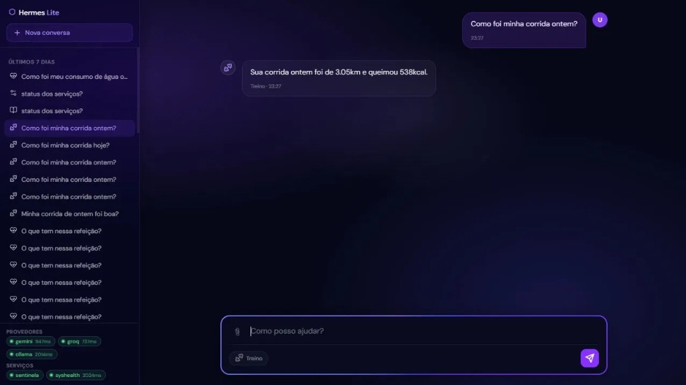

<div align="center">



<br/>

# Hermes Lite

**PT:** Sistema operacional pessoal de IA — 12 agentes especializados, roteamento automático de LLM, memória persistente, RAG, GTD, radar GitHub, Telegram bidirecional e automações autônomas.  
**EN:** Personal AI operating system — 12 specialized agents, automatic LLM routing, persistent memory, RAG, GTD, GitHub radar, bidirectional Telegram and autonomous automations.

<br/>

[](https://python.org)
[](https://flask.palletsprojects.com)
[](https://groq.com)
[](https://aistudio.google.com)
[](https://ollama.ai)
[](https://supabase.com)
[](https://github.com/simoesleandro/hermes-lite/commits)
[](https://github.com/simoesleandro/hermes-lite/issues)

<br/>

[📖 Documentação completa](docs/GUIA-HERMES-LITE.md) &nbsp;·&nbsp;
[🐛 Reportar bug](https://github.com/simoesleandro/hermes-lite/issues) &nbsp;·&nbsp;
[💡 Sugerir feature](https://github.com/simoesleandro/hermes-lite/issues)

</div>

---

## 📋 Índice / Table of Contents

- [Sobre](#-sobre--about)
- [Agentes](#-agentes--agents)
- [Arquitetura](#-arquitetura--architecture)
- [Model Router](#-model-router)
- [Funcionalidades](#-funcionalidades--features)
- [MCP Server](#-mcp-server-cursor--claude-desktop)
- [Cronos](#️-cronos--scheduler-autônomo)
- [Vigia](#️-vigia--monitor-de-sistema)
- [Stack](#-stack)
- [Instalação](#-instalação--setup)
- [Variáveis de Ambiente](#-variáveis-de-ambiente--environment-variables)
- [Serviços Windows](#-serviços-windows-winsw)
- [Arquitetura de pastas](#-estrutura--project-structure)
- [Testes](#-testes--tests)
- [Roadmap](#-roadmap)
- [Autor](#-autor--author)

---

## 📌 Sobre / About

**PT:**  
Hermes Lite é um assistente de IA pessoal que roda no seu PC e conecta 12 agentes especializados a dados reais — saúde, contratos públicos, GitHub, tarefas, PDFs. Com streaming em tempo real, automações agendadas, integração com Telegram e MCP server para Cursor/Claude Desktop. Não é um chat genérico: cada agente tem contexto, ferramentas e modelo LLM próprios, escolhidos automaticamente.

**EN:**  
Hermes Lite is a personal AI assistant that runs on your PC and connects 12 specialized agents to real data — health, public contracts, GitHub, tasks, PDFs. With real-time streaming, scheduled automations, Telegram integration and MCP server for Cursor/Claude Desktop. Not a generic chat: each agent has its own context, tools and LLM model, chosen automatically.

---

## 🤖 Agentes / Agents

| Agente | Especialidade | Tier LLM | Dados / Ferramentas |
|--------|--------------|----------|---------------------|
| **conhecimento** | Perguntas gerais, pesquisa, tecnologia | MEDIUM | Memória `user_facts`, contexto RAG |
| **desenvolvimento** | Código, bugs, arquitetura, Git | MEDIUM | `git_status`, `git_diff`, `git_log` |
| **saude** | Nutrição, hidratação, peso, wearable | SIMPLE | Supabase sys-health — registra água e peso via chat |
| **treino** | Musculação, corrida, Hevy, Amazfit | MEDIUM | sys-health: treinos, análise, sono |
| **produtividade** | GTD, tarefas, foco | MEDIUM | Tabela `tasks` (inbox / today / week / done) |
| **sentinela** | Contratos públicos RJ, PNCP, alertas | MEDIUM | SQLite Sentinela RJ |
| **juridico** | Direito administrativo, Lei 14.133/2021 | HEAVY | Recebe handoffs do Investigador |
| **investigador** | Dossiê multi-fonte com ReAct pattern | HEAVY | CNPJ, contratos, alertas, busca web |
| **leitor** | PDFs — resumo e perguntas | HEAVY | Upload PDF (até 10 MB, 100 págs) |
| **analista** | SQL, Python, gráficos inline | HEAVY | Sandbox pandas/matplotlib/plotly |
| **ops** | Serviços Windows (Hermes, Cronos, Vigia) | SIMPLE | `sc start/stop`, health HTTP |
| **radar** | Curadoria GitHub open source | MEDIUM | GitHub Search API — digest diário com nota 0–10 |

---

## 🏗 Arquitetura / Architecture

```
Canais de entrada:
  UI Web (porta 5050)  →  AgentHub  →  Model Router  →  LLM
  Telegram Bot         →  AgentHub  →  Model Router  →  LLM
  MCP Server (stdio)   →  AgentHub  →  Model Router  →  LLM

Dados externos:
  sys-health (Supabase PostgreSQL)  —  saúde pessoal
  Sentinela RJ (SQLite)             —  contratos públicos
  GitHub API                        —  radar e inbox

Automação:
  Cronos (scheduler)  →  Telegram / Discord
  Vigia (monitor)     →  Discord
```

---

## ⚡ Model Router

Fallback automático em 3 níveis — sem interrupção para o usuário:

```
SIMPLE  →  Gemma 4 12B (Ollama local)  →  Groq          →  Gemini
MEDIUM  →  Groq (llama-3.3-70b)        →  Gemini        →  Gemma 4
HEAVY   →  Gemini 2.5 Flash            →  Groq          →  Gemma 4
```

- **Gemma 4 local** via Ollama — custo zero, sem envio de dados externos
- Se um provider cair, o próximo é tentado automaticamente
- Badge na UI mostra qual LLM respondeu (gemma / groq / gemini) com latência

---

## ✨ Funcionalidades / Features

- ✅ **12 agentes especializados** com roteamento automático por palavra-chave
- ✅ **Model router com fallback** em 3 níveis sem interrupção
- ✅ **Gemma 4 12B local** via Ollama — custo zero, privacidade total
- ✅ **Memória persistente** — `user_facts` extraídos automaticamente das conversas
- ✅ **RAG** — base de conhecimento com busca semântica (Gemini embeddings)
- ✅ **GTD** — sistema de tarefas inbox/today/week/done via chat e API
- ✅ **MCP server** — 30+ ferramentas para Cursor e Claude Desktop
- ✅ **Telegram bidirecional** — chat completo, botões de ação, upload PDF/imagem
- ✅ **Workflows duráveis** — pipeline Investigador → Jurídico persistido no banco
- ✅ **GitHub Radar** — curadoria diária de repos open source com nota 0–10
- ✅ **GitHub Inbox** — PRs, reviews, issues, CI no digest matinal
- ✅ **Webhook CI** — notifica Telegram quando CI falha
- ✅ **Streaming SSE** — tokens chegam em tempo real
- ✅ **Busca FTS** — full-text search em todas as conversas
- ✅ **Export Markdown** — download de qualquer conversa
- ✅ **Gráficos inline** — agente Analista gera e exibe PNGs no chat
- ✅ **Backup automático** — Cronos faz zip do banco às 03:00 (retenção 14 dias)
- ✅ **136 testes** — cobertura de agentes, roteamento, facts, dashboard e webhooks

---

## 🔌 MCP Server (Cursor / Claude Desktop)

```bash
python mcp_server.py
```

**30+ ferramentas** disponíveis para Cursor e Claude Desktop:

| Categoria | Ferramentas |
|-----------|-------------|
| Core | `hermes_chat`, `list_agents`, `classify_message`, `hermes_health` |
| Sentinela | resumo, alertas, busca fornecedor, estatísticas, top contratos |
| sys-health | resumo diário, registrar água, registrar peso |
| Investigador | CNPJ, contratos, alertas, busca web |
| GTD | listar, criar, atualizar tarefas |
| Knowledge | busca RAG, listar documentos |
| Git | status, diff, log |
| Facts | listar, upsert, delete, aprovar pendentes |
| Workflows | `workflow_investigacao_parecer`, handoffs Sentinela↔Investigador↔Jurídico |
| GitHub | inbox, radar run/latest |
| Telegram | `telegram_notify` |

> Config: copiar `mcp-config.example.json` para o Cursor.

---

## 🕐 Cronos — Scheduler Autônomo

Serviço Windows `HermesCronos` com notificações via Telegram ou Discord:

| Tarefa | Horário (BRT) | Canal |
|--------|---------------|-------|
| ☀️ Digest matinal | 07:30 diário | Telegram / Discord |
| 📊 Resumo saúde | 22:00 diário | Telegram / Discord |
| 🔎 Relatório Sentinela | 09:30 segundas | Telegram / Discord |
| 💾 Backup banco | 03:00 diário | — |
| 🧠 Revisão user_facts | 10:00 domingos | Telegram |

```bash
python -m cronos.cronos
python -m cronos.cronos --test   # dispara tudo imediatamente
```

---

## 👁️ Vigia — Monitor de Sistema

Verifica a cada **5 minutos** e alerta no Discord em mudanças de estado:

| Serviço | Verificação |
|---------|-------------|
| Hermes Lite | HTTP localhost:5050 |
| sys-health | Supabase conectado |
| Gemma 4 | Ollama respondendo |
| Cronos | Serviço Windows ativo |

```bash
python -m vigia.vigia
```

---

## 🛠 Stack

| Camada | Tecnologia |
|--------|------------|
| Backend | Python 3.11+ · Flask · Waitress |
| Frontend | HTML/CSS/JS vanilla · glassmorphism dark theme |
| Streaming | SSE (Server-Sent Events) |
| Banco local | SQLite (`db/hermes.db`) |
| LLM local | Gemma 4 12B via Ollama |
| LLM remoto | Groq (llama-3.3-70b) · Gemini 2.5 Flash |
| Saúde | Supabase PostgreSQL (sys-health) |
| IDE | MCP server stdio — Cursor / Claude Desktop |
| Automação | Cronos (APScheduler) · Vigia (monitor) |
| Testes | pytest — 136 testes |

---

## 🚀 Instalação / Setup

### Pré-requisitos / Prerequisites

- Python 3.11+
- [Ollama](https://ollama.ai) com `gemma4:12b` — `ollama pull gemma4:12b`
- Chave Groq gratuita em [console.groq.com](https://console.groq.com)
- Chave Gemini gratuita em [aistudio.google.com](https://aistudio.google.com)
- Supabase configurado (sys-health) — opcional

### Instalação / Installation

```bash
# Clone o repositório
git clone https://github.com/simoesleandro/hermes-lite
cd hermes-lite

# Instale as dependências
pip install -r requirements.txt

# Configure as variáveis de ambiente
cp .env.example .env
# Edite .env com suas chaves

# Rode o projeto
python app.py
# → http://localhost:5050
```

---

## 🔐 Variáveis de Ambiente / Environment Variables

| Variável | Descrição | Padrão |
|----------|-----------|--------|
| `GROQ_API_KEY` | Groq — tier MEDIUM | — |
| `GEMINI_API_KEY` | Gemini Flash — tier HEAVY | — |
| `OLLAMA_GEMMA_MODEL` | Modelo local Ollama | `gemma4:12b` |
| `NEXT_PUBLIC_SUPABASE_URL` | URL Supabase (sys-health) | — |
| `SUPABASE_SERVICE_ROLE_KEY` | Chave service role Supabase | — |
| `SENTINELA_DB_PATH` | SQLite Sentinela RJ | — |
| `GITHUB_TOKEN` | Radar + Inbox GitHub | — |
| `GITHUB_USER` | Usuário GitHub | — |
| `TELEGRAM_BOT_TOKEN` | Bot Telegram | — |
| `TELEGRAM_CHAT_ID` | Chat ID destino | — |
| `NOTIFY_CHANNEL` | Canal Cronos | `telegram` |
| `KNOWLEDGE_RAG` | Habilita RAG | `0` |
| `USER_FACTS_AUTO` | Extrai fatos automaticamente | `0` |

> Lista completa em: [`.env.example`](.env.example)

---

## 🪟 Serviços Windows (WinSW)

| Serviço | XML | Porta |
|---------|-----|-------|
| HermesLite | `hermes-lite-service.xml` | 5050 |
| HermesCronos | `cronos-service.xml` | — |
| hermes-vigia | `vigia-service.xml` | — |

---

## 📁 Estrutura / Project Structure

```
hermes-lite/
├── app.py                 # Entry point UI local (:5050)
├── api_server.py          # Entry point com CORS
├── app_factory.py         # Flask factory — todas as rotas
├── model_router.py        # Roteamento e fallback entre providers
├── mcp_server.py          # MCP server — 30+ tools
├── agents/                # 12 agentes especializados
├── services/              # Clientes externos, Telegram, RAG, workflows
├── db/                    # hermes.db + Database class
├── cronos/                # Scheduler + tasks/
├── vigia/                 # Monitor de sistema
├── static/                # UI web (HTML/CSS/JS)
├── tests/                 # 136 testes pytest
├── exports/               # Pareceres, radar MD
└── backups/               # Backups noturnos automáticos
```

**Fluxo principal:**

```
Mensagem do usuário (Web / Telegram / MCP)
      ↓
classify_agent() — regex + LLM fallback
      ↓
Agente especializado injeta dados reais
      ↓
Model Router → Gemma4 / Groq / Gemini
      ↓
Resposta via SSE streaming
```

---

## 🧪 Testes / Tests

```bash
# Rodar todos os testes
pytest

# Com cobertura
pytest --cov=agents --cov-report=term-missing

# Teste específico
pytest tests/test_classify_agent.py -v
```

> **136 testes** cobrindo roteamento, facts, dashboard, webhooks, sys-health, backup e workflows.

---

## 🗺 Roadmap

- [x] 12 agentes especializados com roteamento automático
- [x] Model router com fallback em 3 níveis
- [x] Gemma 4 12B via Ollama (local, custo zero)
- [x] MCP server com 30+ ferramentas
- [x] Memória persistente com `user_facts`
- [x] RAG com busca semântica
- [x] GTD via chat e API
- [x] Telegram bidirecional com botões de ação
- [x] Workflows duráveis Investigador → Jurídico
- [x] GitHub Radar e Inbox
- [x] Cronos scheduler com 5 tarefas automáticas
- [x] Vigia monitor com alertas Discord
- [ ] Interface mobile nativa (PWA)
- [ ] Agente de email (Gmail MCP)
- [ ] Deploy público com autenticação

---

## 👤 Autor / Author

<div align="center">

**Leandro Simões**

[](https://linkedin.com/in/leandro-sim%C3%B5es-7a0b3537b)
[](https://github.com/simoesleandro)
[](https://simoesleandro.github.io/portfolio)

*Fullstack · IA Aplicada · Civic Tech*

</div>

---

<div align="center">

Feito com ☕ e IA em / Made with ☕ and AI in 🇧🇷 Rio de Janeiro

</div>
