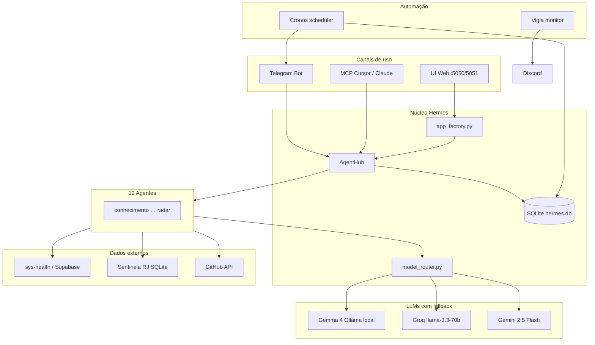

# Hermes Lite — Guia completo

> Plataforma pessoal de IA multi-agente do Leandro Simões.  
> Última revisão: junho/2026 · repo: [github.com/simoesleandro/hermes-lite](https://github.com/simoesleandro/hermes-lite)

---

## 1. O que é

**Hermes Lite** é um assistente de IA que roda no seu PC e conecta vários “especialistas” (agentes) a **dados reais** — saúde, contratos públicos, GitHub, tarefas, PDFs — com streaming em tempo real, automações agendadas e integração com Telegram, Discord e Cursor (MCP).

Não é um chat genérico: cada agente tem contexto, ferramentas e complexidade de modelo próprios. O sistema escolhe o agente e o LLM automaticamente, persiste histórico, dispara pipelines (investigação → parecer jurídico) e envia digests matinais sem você abrir o navegador.

---

## 2. Visão geral da arquitetura



### Stack técnica

| Camada | Tecnologia |
|--------|------------|
| Backend | Python 3.11+ · Flask · Waitress |
| Frontend | HTML/CSS/JS vanilla (estilo Gemini) |
| Streaming | SSE (Server-Sent Events) |
| Banco local | SQLite (`db/hermes.db`) |
| LLMs | Ollama (Gemma 4 12B) · Groq · Gemini API |
| Automação | Cronos (tarefas agendadas) · Vigia (health monitor) |
| Integração IDE | MCP server (`mcp_server.py`) |

### Entry points

| Arquivo | Função |
|---------|--------|
| `app.py` | UI local (porta **5050**; dev comum **5051** se WinSW ocupa 5050) |
| `api_server.py` | Mesmo app com CORS habilitado |
| `app_factory.py` | Todas as rotas HTTP — **editar aqui** ao criar endpoints |
| `services/run_telegram.bat` | Bot Telegram bidirecional |
| `mcp_server.py` | Ferramentas para Cursor / Claude Desktop |
| `python -m cronos.cronos` | Scheduler autônomo |
| `python -m vigia.vigia` | Monitor de serviços |

---

## 3. Os 12 agentes

Cada agente estende `BaseAgent`, define um `system_prompt`, uma `Complexity` (tier de LLM) e pode injetar dados reais antes de chamar o modelo.

| Agente | Especialidade | Tier LLM | Dados / ferramentas |
|--------|---------------|----------|---------------------|
| **conhecimento** | Perguntas gerais, tecnologia, projetos | MEDIUM | Memória `user_facts`, contexto RAG |
| **desenvolvimento** | Código, bugs, arquitetura, Git | MEDIUM | `git_status`, `git_diff`, `git_log` |
| **saude** | Nutrição, hidratação, peso, wearable | SIMPLE | **sys-health** (Supabase): resumo diário; registra água e peso via chat |
| **treino** | Musculação, corrida, Hevy, Amazfit | MEDIUM | sys-health: treinos recentes, análise, sono |
| **produtividade** | GTD, tarefas, foco | MEDIUM | Tabela `tasks` (inbox / today / week / done) |
| **sentinela** | Contratos públicos RJ, PNCP, alertas | MEDIUM | SQLite Sentinela: resumo, alertas, fornecedores |
| **juridico** | Direito administrativo, Lei 14.133/2021 | HEAVY | Recebe handoffs do Investigador; painel Sentinela |
| **investigador** | Dossiê multi-fonte (ReAct) | HEAVY | CNPJ, contratos, alertas, busca web (DuckDuckGo) |
| **leitor** | PDFs — resumo e perguntas | HEAVY | Upload PDF (até 10 MB, 100 págs); PyMuPDF |
| **analista** | SQL, Python, gráficos inline | HEAVY | Sandbox com pandas/matplotlib/plotly; DBs Sentinela + legado SysHealth |
| **ops** | Serviços Windows (Hermes, Cronos, Vigia) | SIMPLE | `sc start/stop`, health HTTP, status providers |
| **radar** | Curadoria GitHub open source | MEDIUM | GitHub Search API; digest diário com nota 0–10 |

### Roteamento automático

Função `classify_agent()` em `app_factory.py`:

1. **Regex** — palavras-chave (água → saúde, contrato → sentinela, etc.)
2. **LLM fallback** — se nenhuma regra bater (`CLASSIFY_LLM_FALLBACK=1`)
3. **Desambiguação** — se várias regras baterem (`CLASSIFY_LLM_DISAMBIGUATE=1`)

Na UI e no Telegram você pode **fixar** um agente (`/agente sentinela`) ou deixar automático (`/auto`).

---

## 4. Model Router — três tiers com fallback

Arquivo: `model_router.py`. Métricas em `GET /api/metrics`.

```
SIMPLE  →  Gemma 4 (Ollama gemma4:12b)  →  Groq  →  Gemini
MEDIUM  →  Groq (llama-3.3-70b)         →  Gemini →  Gemma 4
HEAVY   →  Gemini 2.5 Flash             →  Groq   →  Gemma 4
```

- **Gemma local** (`GEMMA_PROVIDER=ollama`): custo zero, roda no PC via Ollama.
- Se um provider cair, o próximo é tentado sem interromper o usuário.
- Cada resposta registra provider, latência e se foi fallback.

---

## 5. Interface web

Acesse `http://localhost:5050` (ou **5051** em dev).

### Chat

- Streaming token a token (SSE).
- Badge do provider (gemma / groq / gemini).
- Comando `/limpar` — zera contexto da sessão.
- Upload **PDF** (agente Leitor) e **imagem** (agente Treino — visão).
- Gráficos PNG inline (agente Analista).

### Sidebar

| Recurso | Descrição |
|---------|-----------|
| **Dashboard Home** | Visão do dia: GTD, Sentinela, Radar, inbox GitHub, saúde, fatos pendentes |
| **Histórico** | Conversas salvas por `conversation_id` |
| **Busca FTS** | Full-text search nas mensagens (`GET /api/conversations/search`) |
| **Export MD** | Download de conversa em Markdown |
| **Painel Sentinela** | Alertas e stats (agentes Sentinela e Jurídico) |
| **Fatos pendentes** | Aprovar/rejeitar memória extraída automaticamente |
| **Skills** | Atalhos de prompt por agente |

### Painel Ops (`/api/status`, `/api/health`)

Status de: banco Hermes, Telegram, Groq, Gemini, Gemma (Ollama), sys-health, Sentinela.

---

## 6. Telegram bidirecional

Script: `services/telegram_bot.py` (ou `services/run_telegram.bat`).

| Comando | Ação |
|---------|------|
| *(texto livre)* | Roteamento automático de agente |
| `/agente <nome>` | Fixar agente |
| `/auto` | Voltar ao roteamento automático |
| `/status` | Agente atual |
| `/limpar` | Apaga histórico da sessão Telegram |
| `/agentes` | Lista agentes |
| `/alertas` | Painel Sentinela com botões Investigar / Parecer |
| PDF anexo | Roteia para Leitor |
| Foto | Roteia para Treino (vision) |

Variáveis: `TELEGRAM_BOT_TOKEN`, `TELEGRAM_CHAT_ID`, `TELEGRAM_ALLOWED_CHAT_IDS`, `TELEGRAM_STREAMING`, `TELEGRAM_BOT_ENABLED`.

---

## 7. MCP Server (Cursor / Claude Desktop)

`python mcp_server.py` — protocolo stdio.

Expõe **30+ tools**, incluindo:

- **Core:** `list_agents`, `classify_message`, `hermes_chat`, `hermes_health`
- **Sentinela:** resumo, alertas, top contratos, busca fornecedor, estatísticas
- **SysHealth:** resumo, registrar água/peso
- **Investigador:** CNPJ, contratos, alertas, web
- **GTD:** listar/criar tarefas
- **Knowledge:** busca RAG, listar documentos
- **Git:** status, diff, log
- **Facts:** listar, upsert, delete, pending, approve
- **Workflows:** `workflow_investigacao_parecer`, handoffs Sentinela↔Investigador↔Jurídico
- **GitHub:** inbox, radar run/latest
- **Dashboard:** `dashboard_home`
- **Telegram:** `telegram_notify`

Config de exemplo: `mcp-config.example.json`.

---

## 8. Dados e memória (SQLite)

Arquivo: `db/hermes.db`.

| Tabela | Conteúdo |
|--------|----------|
| `messages` | Histórico de chat (por agente, sessão, conversa) |
| `conversations` | Metadados de conversas (título, agente, data) |
| `messages_fts` | Índice FTS5 para busca full-text |
| `tasks` | GTD — inbox, today, week, done + prioridade |
| `user_facts` | Memória estruturada (chave/valor/categoria/status) |
| `workflows` | Pipelines duráveis (Investigador → Jurídico) |
| `knowledge_docs` / `knowledge_chunks` | Base RAG (PDFs indexados) |
| `github_digests` | Picks do Radar GitHub por data |
| `sentinela_auto_workflows` | Dedup de pipelines automáticos Sentinela |

### Memória do usuário (`user_facts`)

- Manual: “lembre que…” via chat ou API.
- Automática: `USER_FACTS_AUTO=1` extrai fatos das conversas (`fact_extractor`).
- Fatos auto ficam **pending** até você aprovar na sidebar ou via MCP `facts_approve`.
- Revisão semanal: Cronos domingo 10:00 (`facts_review`).

### Knowledge RAG

- `KNOWLEDGE_RAG=1` — injeta trechos relevantes no prompt.
- `KNOWLEDGE_EMBEDDINGS=1` — busca semântica (Gemini embeddings).
- `KNOWLEDGE_AUTO_PDF=1` — indexa PDFs enviados automaticamente.
- Upload manual: `POST /api/knowledge`.

---

## 9. Integrações externas

### sys-health (saúde pessoal)

App web Next.js + Supabase — [sys-health.vercel.app](https://sys-health.vercel.app).

Hermes lê e escreve no **mesmo banco Supabase** (`SYSHEALTH_BACKEND=supabase`):

- Resumo: água, peso, proteína, passos, sono, HRV, treino do dia
- Registro via chat (Saúde): água → tabela `agua`; peso → `medidas`
- Legado opcional: Flask `Projeto_Fit/api_server.py` na porta 5060

Variáveis: `NEXT_PUBLIC_SUPABASE_URL`, `SUPABASE_SERVICE_ROLE_KEY`, `SYSHEALTH_USER_ID`, `SYSHEALTH_WEB_URL`.

### Sentinela RJ

SQLite read-only (`SENTINELA_DB_PATH`) — contratos e alertas do PNCP/RJ.

- Resumo, alertas por severidade, busca fornecedor, estatísticas
- Painel na UI e `/alertas` no Telegram
- **Pipeline automático:** alertas severidade **alta** disparam Investigador → Jurídico (`SENTINELA_AUTO_WORKFLOW=1`)

### GitHub

| Feature | Env | Descrição |
|---------|-----|-----------|
| **Radar** | `GITHUB_TOKEN`, `GITHUB_RADAR_ENABLED` | Curadoria diária de repos; digest com nota e markdown em `exports/` |
| **Inbox** | `GITHUB_INBOX_ENABLED`, `GITHUB_USER` | PRs, reviews, issues, CI — aparece no digest matinal |
| **Webhook CI** | `GITHUB_WEBHOOK_SECRET` | `POST /api/webhooks/github` → notifica Telegram se CI falhar |

---

## 10. Workflows e handoffs

Pipeline **Investigador → Jurídico**:

1. Investigador monta dossiê (CNPJ, contratos, web).
2. Jurídico gera parecer administrativo.
3. Export Markdown em `exports/parecer-*.md`.

Disparo manual: API `POST /api/handoff/investigador`, MCP `workflow_investigacao_parecer`, botões no Telegram Sentinela.

Estado persistido em `workflows` — sobrevive a restart do Hermes.

---

## 11. Cronos — tarefas agendadas

Serviço Windows `HermesCronos` ou `python -m cronos.cronos`.

Notificações: **Telegram** (padrão), **Discord** ou **both** (`NOTIFY_CHANNEL`).

| Tarefa | Horário (BRT) | O que faz |
|--------|---------------|-----------|
| **morning_digest** | 07:30 diário | Digest unificado: saúde, GTD, Sentinela, Radar, inbox GitHub; dispara auto-workflow Sentinela |
| **backup** | 03:00 diário | Zip de `hermes.db` + `exports/` → `backups/` (retenção 14 dias) |
| **resumo_saude** | 22:00 diário | Resumo noturno sys-health |
| **sentinela_semanal** | 09:30 segundas | Relatório Sentinela |
| **facts_review** | 10:00 domingos | Lembrete de fatos pendentes para revisão |

Teste imediato: `python -m cronos.cronos --test`

---

## 12. Vigia — monitor de sistema

Serviço `hermes-vigia` ou `python -m vigia.vigia`.

A cada **5 minutos** verifica:

- Hermes Lite (HTTP)
- sys-health / Supabase
- Gemma Ollama
- Serviço Windows Cronos

Alertas de queda/volta no **Discord** (`DISCORD_WEBHOOK_LOGS`). Heartbeat a cada hora.

---

## 13. API REST (principais rotas)

| Rota | Método | Função |
|------|--------|--------|
| `/chat/stream` | GET | Chat com SSE |
| `/chat/classify` | GET | Preview do agente escolhido |
| `/api/conversations` | GET/POST | CRUD conversas |
| `/api/conversations/search` | GET | Busca FTS |
| `/api/conversations/<id>/export` | GET | Export Markdown |
| `/api/dashboard` | GET | Dashboard Home |
| `/api/tasks` | GET/POST/PATCH/DELETE | GTD |
| `/api/facts` | GET/POST | Memória estruturada |
| `/api/facts/<key>/approve` | POST | Aprovar fato pending |
| `/api/knowledge` | GET/POST/DELETE | RAG |
| `/api/workflows` | GET/POST | Pipelines |
| `/api/sentinela/resumo` | GET | Stats Sentinela |
| `/api/github/inbox` | GET | Inbox GitHub |
| `/api/radar/latest` | GET | Último digest Radar |
| `/api/radar/run` | POST | Disparar curadoria |
| `/api/webhooks/github` | POST | Webhook CI → Telegram |
| `/api/metrics` | GET | Métricas LLM 24h |
| `/api/health` | GET | Health unificado |
| `/upload/pdf` | POST | Upload PDF |
| `/upload/image` | POST | Upload imagem |

---

## 14. Variáveis de ambiente essenciais

Copie `.env.example` → `.env`. **Reinicie o Hermes** após qualquer mudança.

### LLM

| Variável | Descrição |
|----------|-----------|
| `GROQ_API_KEY` | Groq (tier MEDIUM) |
| `GEMINI_API_KEY` | Gemini Flash (tier HEAVY) |
| `GEMMA_PROVIDER` | `ollama` (local) ou `gemini` (API paga) |
| `OLLAMA_GEMMA_MODEL` | Ex.: `gemma4:12b` |

### Saúde (sys-health)

| Variável | Descrição |
|----------|-----------|
| `SYSHEALTH_BACKEND` | `supabase` (padrão) ou `legacy` |
| `NEXT_PUBLIC_SUPABASE_URL` | URL do projeto Supabase |
| `SUPABASE_SERVICE_ROLE_KEY` | Chave service role (copiar do sys-health) |
| `SYSHEALTH_USER_ID` | UUID do usuário (recomendado com RLS) |

### Sentinela, GitHub, Telegram

| Variável | Descrição |
|----------|-----------|
| `SENTINELA_DB_PATH` | Caminho SQLite Sentinela RJ |
| `GITHUB_TOKEN` | Radar + Inbox |
| `GITHUB_USER` | Seu usuário GitHub |
| `TELEGRAM_BOT_TOKEN` / `TELEGRAM_CHAT_ID` | Bot + Cronos |

Lista completa: `.env.example`.

---

## 15. Como rodar

### Desenvolvimento (UI)

```powershell
cd C:\Users\Leand\OneDrive\Desktop\hermes-lite
pip install -r requirements.txt
python app.py
# ou, se 5050 ocupada:
python -c "from app_factory import create_app; from waitress import serve; serve(create_app(), host='0.0.0.0', port=5051, threads=8)"
```

### Telegram

```powershell
python services/telegram_bot.py
# ou services/run_telegram.bat
```

### Pré-requisitos externos

- **Ollama** rodando com `gemma4:12b` (`ollama pull gemma4:12b`)
- **sys-health**: Supabase configurado no `.env`
- **Sentinela**: SQLite em `SENTINELA_DB_PATH`
- Chaves Groq + Gemini (APIs gratuitas/baratas)

### Testes

```bash
pytest tests/
```

136+ testes cobrem roteamento, facts, dashboard, webhooks, SysHealth, backup, etc.

### Serviços Windows (WinSW)

| Serviço | XML | Função |
|---------|-----|--------|
| HermesLite | `hermes-service.xml` | UI/API Flask |
| HermesCronos | `cronos-service.xml` | Scheduler |
| hermes-vigia | `vigia-service.xml` | Monitor |
| HermesSysHealthAPI | `syshealth-api-service.xml` | **Legado** — só se usar Flask :5060 |

---

## 16. Fluxos do dia a dia (exemplos)

### Manhã

1. **07:30** — Cronos envia digest no Telegram (saúde, tarefas, alertas Sentinela, repos Radar).
2. Você abre o Hermes → **Dashboard Home** mostra o mesmo resumo na UI.
3. Pergunta “bebi 500 ml” → agente **Saúde** grava no Supabase do sys-health.

### Trabalho com contratos

1. “Quais alertas graves do Sentinela?” → agente **Sentinela**.
2. Clica **Investigar** no Telegram → pipeline **Investigador → Jurídico**.
3. Parecer salvo em `exports/parecer-*.md`.

### Dev + GitHub

1. “O que tem na minha inbox GitHub?” → **Radar** ou Dashboard.
2. CI falha → webhook avisa no Telegram.
3. “gerar radar” → curadoria de repos open source.

### Noite

1. **22:00** — Cronos manda resumo de saúde.
2. **03:00** — backup automático do banco e exports.

---

## 17. Estrutura de pastas

```
hermes-lite/
├── app.py, api_server.py, app_factory.py
├── model_router.py, mcp_server.py
├── agents/              # 12 agentes
├── services/            # Clientes externos, Telegram, RAG, workflows
├── db/                  # hermes.db + Database
├── cronos/              # Scheduler + tasks/
├── vigia/               # Monitor
├── static/              # UI web
├── tests/               # pytest
├── exports/             # Pareceres, radar MD
├── backups/             # Backups noturnos
└── docs/                # Este guia
```

---

## 18. Resumo em uma frase

**Hermes Lite** é o “sistema operacional pessoal” de IA: vários especialistas, dados reais (saúde, contratos, GitHub), memória persistente, automações no Telegram e integração com Cursor — tudo rodando localmente com Gemma no Ollama e fallback para Groq/Gemini.

---

*Autor: Leandro Simões · Projeto de portfólio / uso pessoal · Não commitar `.env` (secrets).*
